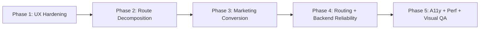

# ContinuWitty Ocean-Flow Product Plan

Date: 2026-03-04  
Scope: Next improvement cycle after the initial ocean-flow rollout

## 1. Goals

1. Make the UI feel fully design-led, not only themed.
2. Move from shared workspace overlays to true dedicated page experiences for each action route.
3. Keep auth and navigation reliable with SPA routing and API-backed session flows.
4. Increase visual delight (motion, depth, storytelling) while preserving accessibility and performance.

## 2. Product Positioning

ContinuWitty is an agent-memory operating layer:

- Persistent memory across sessions
- Provenance-backed retrieval and traceability
- Governance controls for teams and enterprise adoption

Landing and marketing should sell one core promise:  
**“Agents that remember context like long-term collaborators.”**

## 3. IA and Route Strategy

Canonical app namespace remains `/app/*`.  
Legacy paths stay as compatibility redirects.

### 3.1 Public Surface

- `/` landing
- `/product`
- `/how-it-works`
- `/for-enterprise`
- `/for-developers`
- `/pricing`
- `/login`

### 3.2 App Surface (current + next extraction targets)

- Workspace shell: `/app/workspace`
- Sessions:
  - `/app/sessions`
  - `/app/sessions/new`
  - `/app/sessions/:sessionId/chat`
  - `/app/sessions/:sessionId/lifecycle`
  - `/app/sessions/:sessionId/timeline`
  - `/app/sessions/:sessionId/save-engram`
  - `/app/sessions/:sessionId/continue`
- Engrams:
  - `/app/engrams`
  - `/app/engrams/query`
  - `/app/engrams/:engramId`
  - `/app/engrams/:engramId/sources`
  - `/app/engrams/:engramId/rehydrate`
  - `/app/engrams/:engramId/links`
  - `/app/engrams/:engramId/trace`
- Pins:
  - `/app/sessions/:sessionId/pins/engrams`
  - `/app/sessions/:sessionId/pins/documents`
- Documents:
  - `/app/documents`
  - `/app/documents/ingest/text`
  - `/app/documents/ingest/file`
- Projects:
  - `/app/projects`
  - `/app/projects/:projectId/members`
  - `/app/projects/:projectId/audit`
  - `/app/projects/transfer/export`
  - `/app/projects/transfer/import`
- Admin:
  - `/app/admin/sessions`
  - `/app/admin/engrams`
  - `/app/admin/collections`
  - `/app/admin/curation`
  - `/app/admin/contradictions`
  - `/app/admin/tokens`
  - `/app/admin/observability`

## 4. Experience and Motion System

## 4.1 Visual Principles

1. Deep-ocean surfaces with seafoam highlights.
2. Glass layers for secondary controls; solid contrast for primary actions.
3. Dual-strand brand mark used as visual anchor across marketing, login, and app shell.
4. Clear hierarchy: headline glow -> dense operational content.

## 4.2 Motion Rules

1. Keep meaningful motion: strand draw, wave drift, reveal transitions.
2. Keep interaction motion short (120-220ms).
3. Reduced-motion mode disables non-essential ambient animation.
4. No perpetual motion behind dense data tables/forms in admin contexts.

## 5. Work Plan (Implementation Phases)

## Phase 1: UX Hardening

1. Standardize page-level empty, loading, and error states.
2. Add contextual help banners for each action route.
3. Ensure keyboard path for all form actions and route transitions.

## Phase 2: Route-by-Route Decomposition

1. Extract dedicated page components for session lifecycle/timeline/continue/pins.
2. Extract dedicated engram detail/sources/rehydrate/links/trace pages.
3. Extract document ingestion pages as full-page flows (not only side panels).

## Phase 3: Marketing Conversion Upgrade

1. Add “How agents use this in a day” story blocks.
2. Add developer integration snippets (REST + MCP examples).
3. Add enterprise trust strip (audit, token scope, project governance).
4. Add pricing teaser cards with plan comparison matrix shell.

## Phase 4: Backend + Routing Reliability

1. Expand SPA fallback coverage for direct-link refreshes under `/app/*`.
2. Keep compatibility redirects stable (`/ui`, `/ui/admin`, `/admin/memory`, `/projects/transfer`).
3. Maintain API contracts unchanged for `/api/v1/*`.

## Phase 5: Quality and Performance

1. Add Playwright snapshot checks for key routes.
2. Add accessibility checks (focus order, contrast, reduced motion).
3. Introduce route-level code splitting to reduce bundle size warnings.

## 6. Delivery Diagram

## 7. Testing Matrix

1. Auth:
   - Login/logout via `/api/v1/session/*` CSRF flow.
   - Redirect behavior for anonymous vs authenticated users.
2. Routing:
   - Deep-link refresh on representative `/app/*` routes.
   - Legacy redirect correctness.
3. Functional:
   - Session create -> chat -> save engram -> continue flow.
   - Document ingest text/file flow.
   - Admin token create/revoke and observability read.
4. Visual:
   - Landing/login/workspace/admin snapshots at mobile/tablet/desktop.
5. Accessibility:
   - Keyboard-only primary flows.
   - Reduced-motion rendering parity.

## 8. Success Criteria

1. Users can complete all major actions via dedicated routes without relying on overlays.
2. Login/logout is stable with no CSRF extraction failures.
3. Public pages clearly communicate value for agents, developers, and enterprise buyers.
4. Lighthouse/perf/a11y remain acceptable after animation enhancements.

## 9. Risks and Mitigations

1. Risk: Route expansion increases complexity.
   - Mitigation: typed route metadata + layout guards + page-level containers.
2. Risk: Motion may hurt readability/performance.
   - Mitigation: restrained ambient layers + reduced-motion mode + route-level profiling.
3. Risk: UI/API drift during refactors.
   - Mitigation: keep API contracts stable and extend integration tests before visual polish.

