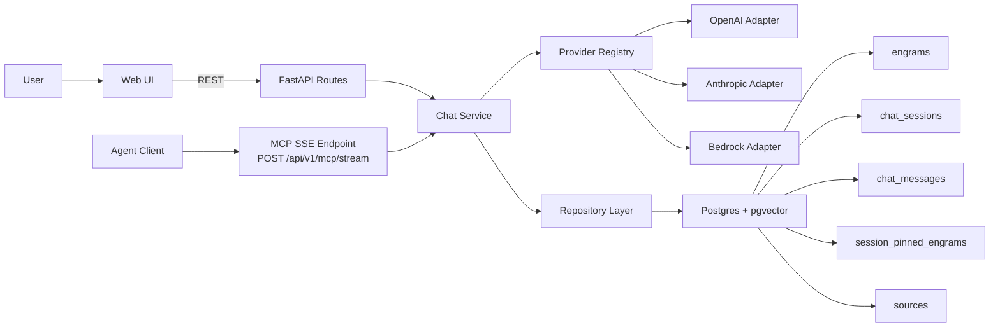
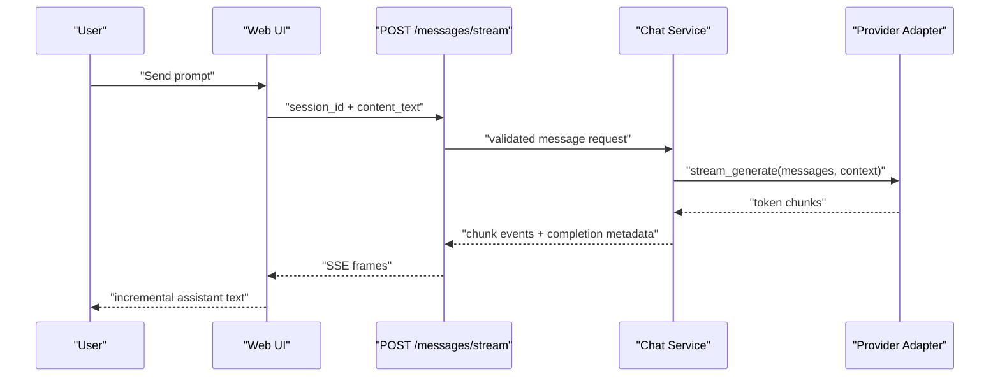
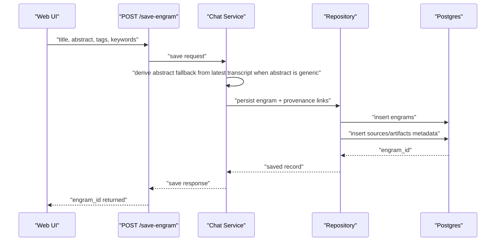
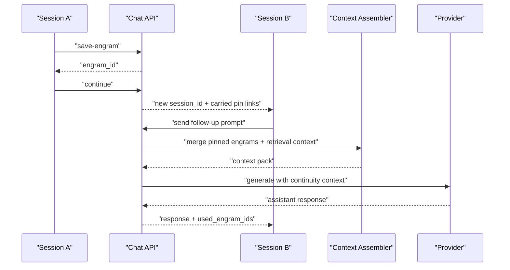
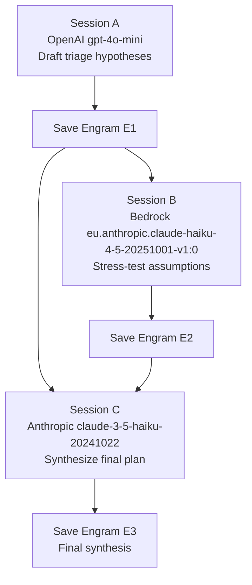
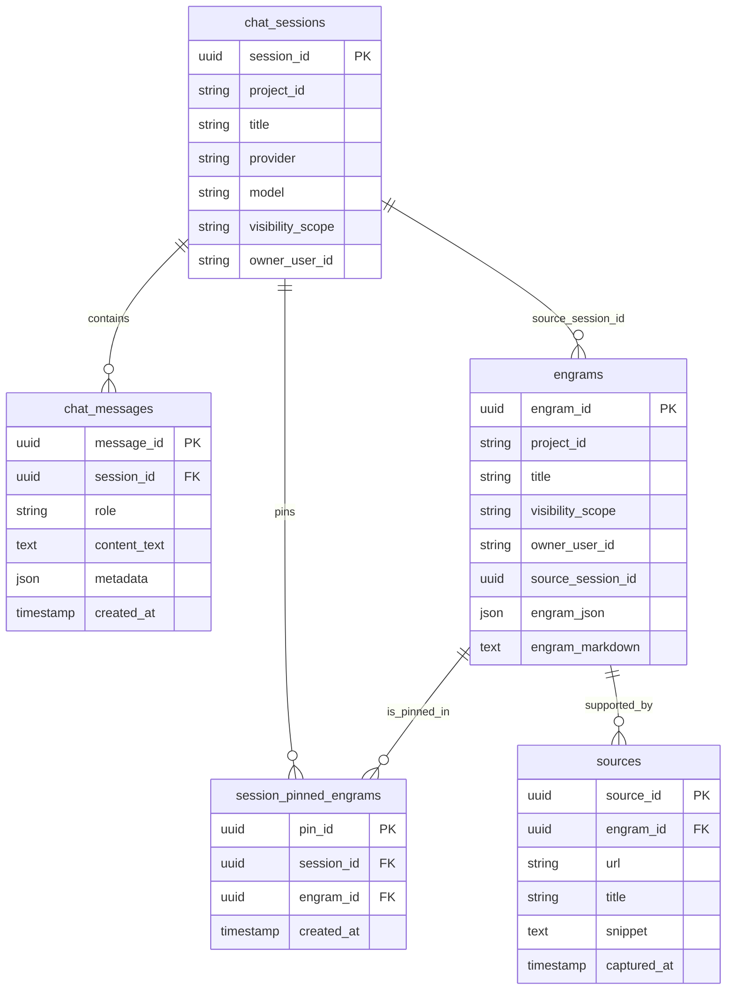

# Engram Architecture Playbook

This guide explains why Engram matters, how the system works end-to-end, and how to run multi-model memory continuity workflows across OpenAI, Anthropic, and Bedrock.

## Why This Matters

### Layer A: Newcomer Narrative

Most AI chats end with valuable context trapped in one session. Engram solves that by turning useful outcomes into durable memory units (engrams) that can be reused across sessions and even across providers.

If one model gives you a strong draft, another can critique it, and a third can produce a final synthesis without losing context. That is the core advantage: continuity with provenance.

### Layer B: Technical Deep Dive

What this means for you.

Engram persists chat outcomes as structured records with metadata (`project_id`, tags, keywords), access controls (`visibility_scope`, `owner_user_id`), and retrieval context. Runtime response metadata (`used_engram_ids`, source references) lets you audit what prior memory influenced a response.

## The Core Idea in 90 Seconds

### Layer A: Newcomer Narrative

1. Start a chat session with any provider/model.
2. Ask questions and capture useful outcomes.
3. Save that outcome as an engram.
4. In a new session (same or different provider), pin/query that engram.
5. Continue analysis with historical context carried forward.

### Layer B: Technical Deep Dive

What this means for you.

Continuity is composed from:

- persisted chat transcript (`chat_messages`)
- explicit pinning (`session_pinned_engrams`)
- retrieval for supporting context
- context assembly in chat service
- provider-agnostic generation via adapter registry

## System Architecture (Visual)

### Layer A: Newcomer Narrative

At a high level, UI/API/MCP call into one continuity pipeline that stores memory in Postgres + pgvector and serves context back to any model.

### Layer B: Technical Deep Dive

What this means for you.

The same domain services back both REST and MCP transport surfaces, so behavior and authorization remain consistent regardless of client path.



## How Calls Are Made

### Layer A: Newcomer Narrative

You can drive Engram through:

1. REST API (direct backend calls)
2. MCP JSON-RPC over SSE (agent/tool calls)
3. UI actions (buttons mapped to backend routes)

### Layer B: Technical Deep Dive

What this means for you.

The three call surfaces are behavior-aligned. You can pick the client path that fits your workflow without changing continuity semantics.

### 1) REST Call Surface

**Key route examples**

- `POST /api/v1/chat/sessions`
- `POST /api/v1/chat/sessions/{session_id}/messages`
- `POST /api/v1/chat/sessions/{session_id}/messages/stream`
- `POST /api/v1/chat/sessions/{session_id}/save-engram`
- `POST /api/v1/chat/sessions/{session_id}/continue`

**Input fields (typical)**

- session create: `project_id`, `title`, `provider`, `model`, `visibility_scope`
- send message: `content_text`
- save engram: `title`, `abstract`, `tags`, `keywords`, `visibility_scope`
- continue: `title`, optional overrides

**Output highlights**

- session endpoints return `session_id`, provider/model metadata
- message endpoints return assistant response text and metadata
- save endpoint returns `engram_id`
- continue endpoint returns new `session_id` with carried context links

**Where `used_engram_ids` appears**

- assistant message response metadata (`POST /messages` and stream completion payload)

**Where source references appear**

- assistant message metadata as citation/source reference payloads

```bash
curl -X POST http://localhost:8000/api/v1/chat/sessions \
  -H "Content-Type: application/json" \
  -d '{
    "project_id": "engram-vault",
    "title": "Incident Triage Session A",
    "provider": "openai",
    "model": "gpt-4o-mini",
    "visibility_scope": "project"
  }'
```

```bash
curl -X POST http://localhost:8000/api/v1/chat/sessions/<session_id>/messages \
  -H "Content-Type: application/json" \
  -d '{"content_text": "Summarize current incident signals and likely impact."}'
```

```bash
curl -X POST http://localhost:8000/api/v1/chat/sessions/<session_id>/save-engram \
  -H "Content-Type: application/json" \
  -d '{
    "title": "P1 Payments Triage Snapshot",
    "abstract": "Early triage state and evidence.",
    "tags": ["incident", "payments"],
    "keywords": ["latency", "rollback"],
    "visibility_scope": "project"
  }'
```

How to verify it worked.

- Confirm each call returns the expected IDs (`session_id`, `engram_id`) and response metadata payloads.
- Re-query the saved engram and verify it can be pinned/reused in a new session.

### 2) MCP JSON-RPC over SSE Surface

**Tool examples**

- `chat.create_session`
- `chat.send_message`
- `chat.save_as_engram`
- `engram.query`

**Input fields (typical)**

- JSON-RPC envelope: `jsonrpc`, `id`, `method`, `params`
- params mirror domain inputs (`session_id`, `content_text`, `project_id`, etc.)

**Output highlights**

- `result` frame on success
- `error` frame on failure
- `mcp.event` progress frames for streamed operations

**Where `used_engram_ids` appears**

- in tool `result` metadata for response-bearing tools (for example `chat.send_message`)

**Where source references appear**

- in tool `result` metadata and/or `mcp.event` completion frame data

```json
{
  "jsonrpc": "2.0",
  "id": "mcp-1",
  "method": "chat.create_session",
  "params": {
    "project_id": "engram-vault",
    "title": "Cross-model review",
    "provider": "anthropic",
    "model": "claude-3-5-haiku-20241022",
    "visibility_scope": "project"
  }
}
```

```json
{
  "jsonrpc": "2.0",
  "id": "mcp-2",
  "method": "chat.send_message",
  "params": {
    "session_id": "<session_id>",
    "content_text": "Challenge the assumptions from pinned incident memory.",
    "stream": true
  }
}
```

How to verify it worked.

- Confirm SSE returns JSON-RPC `result` frames for successful calls.
- For streamed calls, verify `mcp.event` frames culminate in a completion event with response metadata.

### 3) UI Workflow Mapping

**Button-to-call mapping**

- `Create Session` -> `POST /api/v1/chat/sessions`
- `Send` -> `POST /api/v1/chat/sessions/{session_id}/messages/stream` (or non-stream fallback)
- `Save as Engram` -> `POST /api/v1/chat/sessions/{session_id}/save-engram`
- `Continue in New Chat` -> `POST /api/v1/chat/sessions/{session_id}/continue`
- `Pin` (in pinned panel) -> `POST /api/v1/chat/sessions/{session_id}/engrams/pin`

**Input fields from UI controls**

- provider/model selectors
- title/system prompt/autosave options
- engram metadata in save modal

**Output highlights in UI**

- live assistant stream in transcript
- engram IDs in pinned panel
- continuity behavior in new session after continue

**Where `used_engram_ids` appears**

- returned by backend in response metadata; can be inspected via API responses and continuity-aware logs

**Where source references appear**

- response metadata payloads attached to assistant replies

How to verify it worked.

- Create a session, send a prompt, save as engram, continue into a new session, then ask a follow-up that depends on prior memory.
- Confirm the new response structurally references prior memory via metadata and continuity behavior.

## End-to-End Sequences

### Layer A: Newcomer Narrative

These sequences show exactly how continuity is built and reused.

### Layer B: Technical Deep Dive

What this means for you.

Each sequence corresponds to a concrete system invariant: stream integrity, durable snapshot persistence, and context carry-forward with provenance.

### Chat Streaming Sequence



How to verify it worked.

- Observe token-by-token updates in transcript.
- Confirm final completion contains response metadata.

### Save-As-Engram Sequence



How to verify it worked.

- Save from UI modal and confirm returned `engram_id` appears in pinned/searchable context.
- Rehydrate via API and check transcript-derived summary quality.

### Continue-In-New-Chat with Pinned Engrams



How to verify it worked.

- Continue from Session A into Session B, ask a follow-up requiring prior context, and inspect `used_engram_ids` in response metadata.

### Cross-Model Analysis Loop



How to verify it worked.

- Ensure each next session can consume prior engram IDs and produce a higher-quality synthesis than single-session prompts.

### Data Relationships (ER-Style)



How to verify it worked.

- Create a session, write messages, save as engram, pin it in another session, and confirm linked records exist via API list/query/rehydrate flows.

## Multi-Model Session Playbooks

### Layer A: Newcomer Narrative

Use these runbooks to turn isolated chats into durable multi-model analysis.

### Layer B: Technical Deep Dive

What this means for you.

Each playbook is designed to exercise session persistence, engram lifecycle, provider interoperability, and continuity metadata under realistic workflows.

### Playbook 1: Incident Triage Continuity

#### Preconditions

- API and web are running.
- Authenticated user with access to `engram-vault` project.
- Provider credentials configured for at least OpenAI, Anthropic, Bedrock.

#### UI Steps

1. Create Session A with provider `openai` and model `gpt-4o-mini`.
2. Ask for an incident timeline and likely blast radius.
3. Click `Save as Engram` and title it `P1 Payments Triage Snapshot`.
4. Create/continue Session B with provider `bedrock` and model `eu.anthropic.claude-haiku-4-5-20251001-v1:0`.
5. Pin Session A engram in Session B.
6. Ask Bedrock to challenge assumptions and enumerate unknowns.
7. Continue into Session C with provider `anthropic` model `claude-3-5-haiku-20241022`.
8. Ask for customer update + 24h remediation + 7d prevention plan.
9. Save final synthesis as engram.

How to verify it worked.

- Session B and C outputs should reflect prior context.
- Response metadata should show reused memory identifiers (`used_engram_ids`) in continuity-aware responses.
- Final engram should be queryable and rehydratable.

#### Equivalent API Snippets

```bash
# Session A
curl -X POST http://localhost:8000/api/v1/chat/sessions \
  -H "Content-Type: application/json" \
  -d '{"project_id":"engram-vault","title":"P1 Triage A","provider":"openai","model":"gpt-4o-mini","visibility_scope":"project"}'

# Save Session A as Engram
curl -X POST http://localhost:8000/api/v1/chat/sessions/<session_a_id>/save-engram \
  -H "Content-Type: application/json" \
  -d '{"title":"P1 Payments Triage Snapshot","abstract":"Incident triage memory.","tags":["incident","payments"],"keywords":["p1","latency"],"visibility_scope":"project"}'

# Continue to Session B
curl -X POST http://localhost:8000/api/v1/chat/sessions/<session_a_id>/continue \
  -H "Content-Type: application/json" \
  -d '{"title":"P1 Triage B - Stress Test","provider":"bedrock","model":"eu.anthropic.claude-haiku-4-5-20251001-v1:0"}'
```

#### Expected Artifacts

- Engram IDs for Session A snapshot and Session C synthesis.
- Pinned engram links in Session B/C.
- Continuity evidence in response metadata.

### Playbook 2: Product Strategy Research

#### Preconditions

- Same as Playbook 1.

#### UI Steps

1. Session A (`openai` / `gpt-4o-mini`): generate market hypotheses and constraints.
2. Save as engram `Q2 Strategy Hypotheses`.
3. Session B (`bedrock` / `eu.anthropic.claude-haiku-4-5-20251001-v1:0`): pin the engram and request risk critique.
4. Save critique as engram `Q2 Strategy Risks`.
5. Session C (`anthropic` / `claude-3-5-haiku-20241022`): pin both engrams and request decision memo with citations.
6. Save final memo engram.

How to verify it worked.

- Session C memo should reconcile hypotheses and risks from both prior engrams.
- Query results should return all three strategy engrams with consistent metadata.

#### Equivalent API Snippets

```bash
# Query strategy memories
curl -X POST http://localhost:8000/api/v1/engrams/query \
  -H "Content-Type: application/json" \
  -d '{"query":"Q2 strategy risks and final recommendation","project_id":"engram-vault","top_k":5}'

# Rehydrate final strategy memo
curl http://localhost:8000/api/v1/engrams/<final_strategy_engram_id>/rehydrate
```

#### Expected Artifacts

- Three linked strategy engrams (hypothesis, critique, synthesis).
- Rehydration bundle containing a compact context pack with citations.

### Playbook 3: Support Escalation Handoff

#### Preconditions

- Same as Playbook 1.

#### UI Steps

1. Session A (`openai`): summarize customer symptom timeline and diagnostics performed.
2. Save as engram `Support Escalation Seed`.
3. Session B (`anthropic`): pin seed engram and request remediation options with tradeoffs.
4. Save as engram `Support Remediation Options`.
5. Session C (`bedrock`): pin both engrams and generate customer-safe response + internal engineering follow-up checklist.
6. Save final handoff engram.

How to verify it worked.

- Final response should include both customer-facing and internal action tracks.
- Continuity should preserve details from diagnostics and remediation tradeoffs.

#### Equivalent API Snippets

```bash
# Send continuity-dependent message in Session C
curl -X POST http://localhost:8000/api/v1/chat/sessions/<session_c_id>/messages \
  -H "Content-Type: application/json" \
  -d '{"content_text":"Draft customer update and internal engineering action checklist using pinned escalation context."}'
```

#### Expected Artifacts

- Escalation seed engram, remediation engram, final handoff engram.
- Reusable handoff memory for future similar escalations.

## Example LLM Outputs (Illustrative)

These are **example outputs**. Real responses vary by provider/model, prompt framing, and context state.

### Incident Triage Continuity

- Session A (OpenAI) example assistant output:

> "Likely incident start is 09:42 UTC with elevated payment API latency. Initial blast radius appears concentrated in checkout retries and delayed captures."

- Session B (Bedrock) example assistant output:

> "Key assumption to challenge: database saturation is root cause. Missing evidence includes cache hit-rate deltas and write amplification after rollback."

- Session C (Anthropic) example assistant output:

> "Customer update: We identified elevated payment latency and are actively mitigating. 24h plan: stabilize writes and validate replay safety. 7d plan: add saturation alerts, rollback drills, and dependency isolation tests."

- Final synthesized example:

> "Using prior triage and stress-test memories, the top risk is repeated saturation during peak retries; recommended mitigation pairs short-term throttling with long-term queue partitioning."

### Product Strategy Research

- Session A (OpenAI) example assistant output:

> "Opportunity hypothesis: accelerate onboarding with guided templates to reduce week-1 drop-off."

- Session B (Bedrock) example assistant output:

> "Risk critique: template-driven onboarding may overfit novice use cases and reduce enterprise flexibility."

- Session C (Anthropic) example assistant output:

> "Decision memo: launch guided templates for SMB segment with feature flags; defer enterprise default until customization controls are validated."

- Final synthesized example:

> "Prior engrams show a viable SMB growth path with manageable risk if rollout remains segmented and measured."

### Support Escalation Handoff

- Session A (OpenAI) example assistant output:

> "Customer reports intermittent checkout failures after midnight deploy; diagnostics show 502 spikes and elevated retry volume."

- Session B (Anthropic) example assistant output:

> "Remediation options: temporary retry backoff, targeted cache warm-up, and canary rollback for affected shard set."

- Session C (Bedrock) example assistant output:

> "Customer response draft: We have stabilized checkout reliability and are monitoring transaction completion. Internal follow-up: shard health audit, retry policy tuning, and postmortem by EOD."

- Final synthesized example:

> "Escalation memory enables consistent customer messaging while preserving internal technical detail for engineering follow-through."

### Nondeterminism Note

Validate structure, not exact wording:

- response addresses requested task
- continuity-dependent prompts reflect pinned/previous engram context
- metadata includes continuity/citation indicators where available

## API and MCP Quick Reference

### Layer A: Newcomer Narrative

Use this section as a fast checklist while running sessions.

### Layer B: Technical Deep Dive

What this means for you.

These are existing interfaces. This playbook does not introduce new runtime contracts.

### REST Endpoints (existing)

- `/api/v1/chat/sessions*`
- `/api/v1/engrams*`
- `/api/v1/mcp/stream`

### MCP Methods (existing)

- `chat.create_session`
- `chat.send_message`
- `chat.save_as_engram`
- `engram.query`

### Runtime Metadata Semantics (existing)

- `used_engram_ids`: identifies engrams reused during response generation.
- source references: identifies citation/source context merged into response generation.

### API/Schema/Type Impact

- No new runtime APIs added.
- No schema/type changes.
- This document clarifies existing behavior only.

## Failure Modes and Debug Guide

### Layer A: Newcomer Narrative

If continuity seems wrong, check session selection, pin state, and provider configuration first.

### Layer B: Technical Deep Dive

What this means for you.

Most issues are traceable to one of four layers: auth/session context, provider call path, memory selection, or stream transport.

Common checks:

1. Auth/session
- Verify you are logged in and operating in the intended project.

2. Provider
- Confirm provider credentials and model names in `.env`.
- Default model names used in this project:
  - `gpt-4o-mini`
  - `claude-3-5-haiku-20241022`
  - `eu.anthropic.claude-haiku-4-5-20251001-v1:0`

3. Continuity
- Verify target engrams are pinned to the active session.
- Query and rehydrate engrams directly to inspect stored context quality.

4. Streaming
- Verify SSE endpoint path and event framing (`/messages/stream` and `/api/v1/mcp/stream`).

How to verify it worked.

- Run one continuity prompt after pinning and confirm response reflects prior context and expected metadata behavior.

## Best Practices for Durable Engrams

### Layer A: Newcomer Narrative

Good engrams are specific, portable, and evidence-backed.

### Layer B: Technical Deep Dive

What this means for you.

Use these patterns for high reuse value:

- Use concrete titles (`P1 Payments Triage Snapshot`, not `Notes`).
- Capture strong abstracts (or let transcript-derived fallback enrich generic snapshots).
- Keep tags/keywords task-centric (`incident`, `rollback`, `latency`).
- Save intermediate critique engrams before final synthesis.
- Use project visibility intentionally.
- Rehydrate periodically to inspect context quality and citation signal.

## Glossary

- **Engram**: durable memory record representing useful outcomes from a run/session.
- **Continuity**: reuse of prior memory in new sessions.
- **Pinned Engram**: engram explicitly attached to a chat session for prioritized context reuse.
- **Rehydration Bundle**: compact context package for quickly restoring prior memory to a model.
- **Provider Adapter**: normalized integration layer for OpenAI/Anthropic/Bedrock.
- **MCP SSE**: JSON-RPC over Server-Sent Events transport surface for tool-driven clients.
